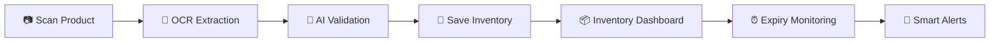
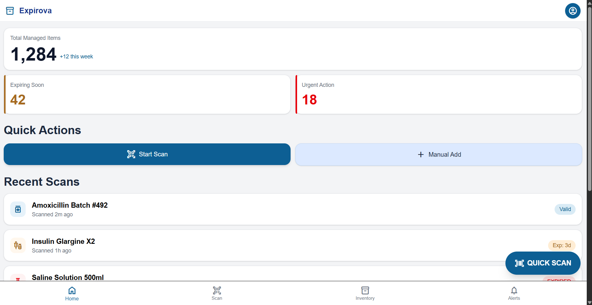
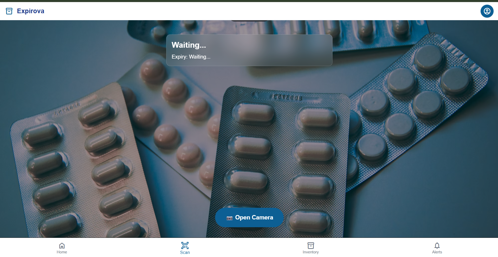
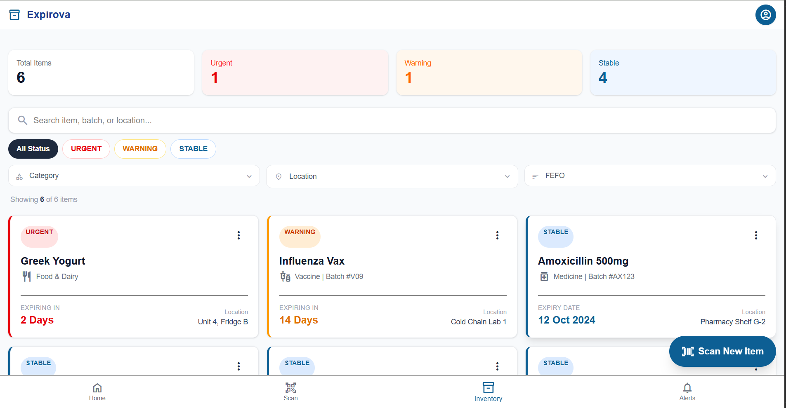
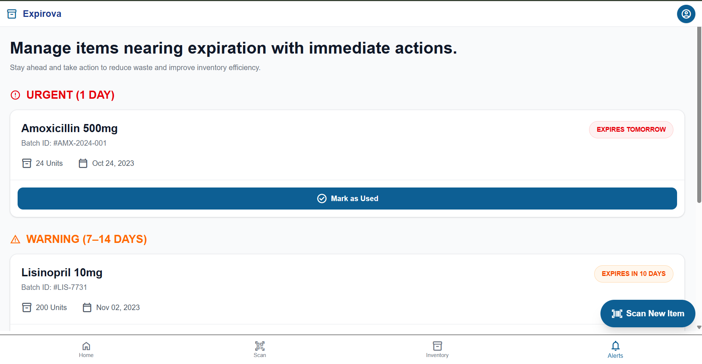
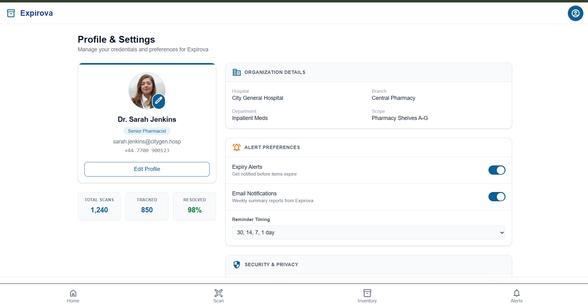
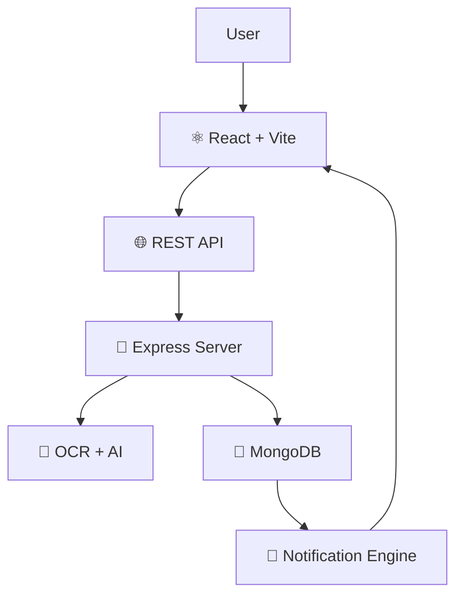

  

**AI-Powered Smart Expiry Management System**

*Scan • Track • Monitor • Prevent Waste*

---

# ✨ Features at a Glance

<table>
<tr>
<td align="center" width="25%">

### 📸 Smart OCR Scan
Extracts medicine details directly from labels using AI-powered OCR.

</td>

<td align="center" width="25%">

### 📦 Inventory Management
Organize, search, filter, and manage products using FEFO.

</td>

<td align="center" width="25%">

### 🚨 Smart Alerts
Receive proactive notifications before products expire.

</td>

<td align="center" width="25%">

### 📊 Analytics Dashboard
Monitor inventory health with real-time statistics.

</td>
</tr>
</table>

---

# ⚡ User Flow

---

# 🖼️ Application Screenshots

<table>
<tr>

<td align="center">

### 📊 Dashboard

Real-time inventory overview, analytics, quick actions and recent scans.

</td>

<td align="center">

### 📷 Smart Scanner

Capture medicine labels and extract expiry information automatically.

</td>

</tr>

<tr>

<td align="center">

### 📦 Inventory

Search, filter, categorize and manage inventory using FEFO.

</td>

<td align="center">

### 🚨 Alerts

Automatically highlights products requiring immediate attention.

</td>

</tr>

<tr>

<td colspan="2" align="center">

### 👤 Profile & Settings

Manage organization details, reminders, notification preferences and profile settings.

</td>

</tr>

</table>

---

# 🚀 System Architecture

---

# 💻 Tech Stack

| Frontend | Backend | Database | AI |
|-----------|----------|-----------|-----|
| React | Node.js | MongoDB | OCR |
| Vite | Express | Mongoose | AI Parsing |
| Tailwind CSS | JWT | Atlas | OpenCV |
| React Router | REST APIs | | |

---

# 🌟 Why Expirova?

> 💊 Scan medicines in seconds.

> 🤖 AI extracts expiry details automatically.

> 📦 Smart inventory management.

> 🚨 Real-time expiry monitoring.

> 📈 Interactive dashboard.

> 📱 Responsive across all devices.

> ⚡ Built for hospitals, pharmacies and healthcare institutions.

---

# 🏆 Built For

🏥 Hospitals

💊 Pharmacies

🧪 Laboratories

🏬 Warehouses

🥫 Food Inventory

🏪 Retail Stores

---

## ⭐ If you like Expirova, consider giving this repository a star!

  

